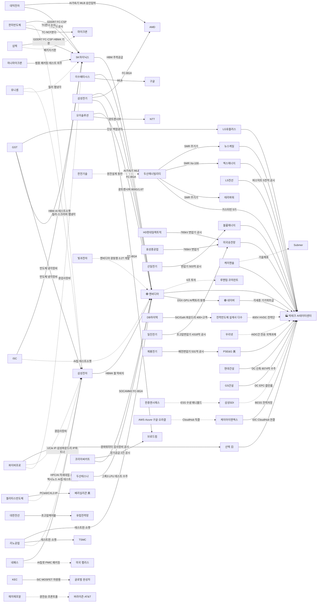

# AI 데이터센터(AIDC) 밸류체인 심층 스터디

> 목적: 젠슨 황이 GTC 2026에서 강조한 AIDC 사업 방향을 산업 리포트 수준으로 공부하고, 각 분야를 어떤 국내 기업이 영위하는지 전수 매핑.
> 출처: NVIDIA GTC 2026/Taipei 2026 키노트, NVIDIA 기술블로그, 국내 증권사 섹터 리포트, 산업 언론. 작성 2026-06-09.

---

## PART 1. 산업 공부 — "왜 AI 팩토리인가"

### 1-1. 패러다임 전환: 데이터센터 → AI 팩토리
- 전통 데이터센터 = 데이터를 **저장·처리**하는 곳.
- AI 팩토리 = **전기를 토큰(token)으로 바꾸는 산업 설비**. 입력은 전력, 출력은 AI 추론 결과(토큰).
- 젠슨 황: *"고객은 컴퓨터를 사는 게 아니라 AI 팩토리를 짓는다."*
- 핵심 함의: 데이터센터가 **반도체 구매 → 부동산·전력·플랜트 엔지니어링** 영역으로 확장됨. 그래서 전력기기·건설·냉각·발전 기업이 'AI 수혜주'가 된다.

### 1-2. 새 핵심 지표: tokens per watt (와트당 토큰)
- AI 팩토리는 **전력 제약 시스템**. 전력 공급(MW)은 한정 → 같은 전력으로 더 많은 토큰을 뽑는 효율이 곧 수익.
- 파생 지표: `tokens per second per megawatt`, `cost per token`.
- 결론: **GPU·CPU·메모리·네트워킹·냉각·전력공급이 하나의 시스템으로 통합 설계**되어야 효율이 극대화됨 → 엔비디아가 "풀스택(Full AI Stack)"을 파는 이유. 부품 하나만 파는 게 아니라 랙·전력·냉각·네트워크까지 묶어서 판다.

### 1-3. GTC 2026 4대 기술 강조축 (상세)

**① 전력 — 800V HVDC 전환 (가장 큰 구조 변화)**
- 현재 랙: 54V 기반. Blackwell(GB200) 랙 ≈ 120kW.
- 차세대 Kyber 랙(Rubin Ultra GPU 576개 탑재, 2027 양산): **600kW ~ 1MW**.
- 기존 AC 배전(4~5단계: 변압→UPS→PDU→...)으로는 1MW를 감당 못 함 → **800V HVDC(고전압 직류)** 직접 배전으로 전환.
  - 효과: UPS·PDU 제거 → 배전 단계 4~5단 → 2단. 종단 효율 83% → 92%↑, **구리 사용 45%↓, 총소유비용(TCO) 약 30%↓.**
- 파트너: Navitas(GaN/SiC 전력반도체), OCP 생태계.
- **투자 함의**: 변압기·전력기기 수요 + **전력반도체(GaN/SiC)** 신규 수혜. 800V→GPU 저전압 변환을 GaN/SiC가 담당.

**② 네트워킹 — CPO·실리콘포토닉스 ("구리의 벽" 돌파)**
- GPU 수만 개를 묶어 하나처럼 쓰려면 초고속 인터커넥트 필수. 구리 케이블은 거리·전력 한계(구리의 벽).
- 해법: **빛(광)으로 통신.** 광트랜시버 → **CPO(Co-Packaged Optics, 공동패키징광학)**: 광엔진을 스위치 ASIC 패키지 안에 직접 통합.
  - 효과: 전력 소모 최대 3.5배↓, 복원력 10배↑. 네트워킹은 AI DC 전력의 15~25% 차지 → CPO의 70% 전력 절감이 결정적.
- 로드맵: Quantum-X InfiniBand 스위치(2026 상반기), Spectrum-X Photonics 이더넷(2026 하반기). 둘 다 **액랭(liquid-cooled)**.
- **투자 함의**: 광트랜시버(800G→1.6T→CPO) 업체, 실리콘포토닉스, 광패키징 신규 테마.

**③ 냉각 — 공랭 → 수랭/액침 전면 전환**
- 1MW 랙은 공기로 못 식힘. 수랭(direct-to-chip), 액침냉각(immersion)으로 전환.
- CDU(냉각분배장치), 자연냉매, 단상/이상(2-phase) 액침 등.
- **투자 함의**: 액침냉각·CDU·냉난방공조(HVAC) 업체.

**④ 컴퓨트 — Vera Rubin / HBM4 / DSX**
- 차세대 플랫폼 **Vera Rubin** (CPU=Vera, GPU=Rubin), HBM4 탑재.
- **DSX**: AI 팩토리를 디지털트윈으로 설계·운영·최적화하는 플랫폼.
- 에이전틱 AI 도래 → 메모리·컨텍스트가 1차 제약 → HBM 수요 지속.
- **투자 함의**: HBM(SK하이닉스·삼성전자), TC본더(한미반도체), 첨단패키징, 디지털트윈.

---

## PART 2. 분야별 국내 상장사 전수 매핑

> ⚠️ 종목 나열은 '밸류체인 소속'이지 추천이 아니다. 실제 수주·납품 레퍼런스와 매출 비중을 별도 검증할 것. 비상장은 (비상장) 표기.

### 분야 1. AI 반도체 (GPU·NPU·설계)
| 구분 | 기업 | 포지션 |
|------|------|--------|
| 파운드리(전력반도체) | DB하이텍 | SiC/GaN 공정 개발, 저전력 파운드리 |
| NPU 설계 | (비상장) 리벨리온, 퓨리오사AI | 국산 AI가속기 → [[themes/퓨리오사AI]] |
| IP·설계 | 오픈엣지테크놀로지, 가온칩스, 에이디테크놀로지 | NPU IP / 디자인하우스 |
> 글로벌 대장: 엔비디아(독점), AMD, 브로드컴(ASIC). 국내는 설계·파운드리 일부 참여.

### 분야 2. HBM·메모리 (한국 최강 분야)
| 기업 | 포지션 |
|------|--------|
| SK하이닉스 | HBM 글로벌 1위, 엔비디아 핵심 공급, HBM4 선두 |
| 삼성전자 | HBM3E 진입, HBM4 추격, 메모리+파운드리 풀스택 |
| 한미반도체 | HBM용 TC본더(열압착본딩) 장비 독점 |
> 슈퍼사이클 정중앙. 단 딥시크류 효율화가 최대 리스크.

### 분야 3. 후공정·첨단패키징·기판
| 기업 | 포지션 |
|------|--------|
| 한미반도체 | TC본더, HBM 후공정 장비 대장 |
| 삼성전기 | 서버용 FC-BGA 기판 국내 1위(국내 최초 양산), 엔비디아·AMD 공급 기대 |
| 대덕전자 | FC-BGA 기판 |
| 이수페타시스 | MLB(고다층 PCB), AI 가속기·스위치용 기판 |
| LG이노텍 | FC-BGA 기판 진입 |
| 하나마이크론 / SFA반도체 | OSAT(외주 패키징·테스트) |
| 테크윙 / ISC / 리노공업 | 테스트 소켓·핸들러 |
> 첨단패키징(CoWoS)은 TSMC가 글로벌 병목. 국내는 기판·장비·테스트로 참여.

### 분야 4. 네트워킹·광통신·CPO (2026 신규 핫테마)
| 기업 | 포지션 |
|------|--------|
| 오이솔루션 | 광트랜시버 국내 1위. 800G→1.6T(26 하반기)→CPO(ELSFP) 로드맵 |
| 빛과전자(구 라이트론) | 광트랜시버 2위, IC·LD·PD 모듈 밸류체인 |
| 퀄리타스반도체 | 고속 인터커넥트 IP, 실리콘포토닉스 |
| 파이버프로 | 광부품, 실리콘포토닉스 |
| 대한광통신 | 광섬유·광케이블 |
| 레이저쎌 | 레이저 본딩(CPO 패키징 장비) |
| 큐에스아이 / 한국첨단소재 | 레이저다이오드 / 광 소재 |
> 상세: [[themes/광통신-CPO]]

### 분야 5. 전력 인프라 (변압기·전선·배전)
| 기업 | 포지션 |
|------|--------|
| HD현대일렉트릭 | 초고압 변압기 수출 폭발, 미국 전력망 + 800V HVDC 수혜 대장 |
| 효성중공업 | 변압기 강자, 미국 시장 확대 |
| LS ELECTRIC | 배전·전력자동화·차단기, DC 전력 인프라 |
| 일진전기 | 전력기기 물량 증가율 1위 전망, 26년 OP 상향 기대 |
| 산일전기 | 특수변압기, 신재생·DC 수혜 |
| 제룡전기 | 변압기, 미국 수출 |
| LS전선시스템(LS) / 대한전선 | 초고압 케이블, 데이터센터 전력 케이블 |
> 상세: [[themes/변압기]] · [[themes/전선]] · [[themes/해저케이블]]

### 분야 6. 전력반도체 (GaN·SiC) — 800V HVDC 신규 수혜
| 기업 | 포지션 |
|------|--------|
| DB하이텍 | 전력반도체 파운드리 강자, SiC/GaN 공정 개발 |
| KEC | SiC 전력반도체 국책과제 성공, 양산 |
> 글로벌 핵심: Navitas(엔비디아 800V 파트너), 인피니언, ON세미. 상세: [[themes/전력반도체]]

### 분야 7. 냉각 (액침·수랭·공조)
| 기업 | 포지션 |
|------|--------|
| GST | 국내 액침냉각 1위 기술(단상·이상 모두 보유), LG유플러스 첫 상업납품 |
| 케이엔솔 | 스페인 Submer(글로벌 1위)와 협력, 테스트부스 운용 |
| 지엔씨에너지 | 데이터센터 비상발전·냉각 |
| 신성이엔지 | 클린룸·냉각 솔루션 |
| 인성정보 | 액침냉각 시스템(전력효율 30%↑) |
> 상세: [[themes/액침냉각]] · [[themes/냉난방공조]]

### 분야 8. 전력 생산·데이터센터 건설
| 기업 | 포지션 |
|------|--------|
| 두산에너빌리티 | AI 전력 대란 해결사. 원전·SMR 주기기 독점 + 가스터빈 슈퍼사이클. 26년 수주 14조 전망 |
| 한전기술 | 원전 설계, 두산과 동반 수혜 |
| 비에이치아이 | 발전 기자재(HRSG 등) |
| GS건설 / 현대건설 | 데이터센터 건설·EPC |
> 상세: [[themes/원자력]] · [[themes/SMR]]

### 분야 9. AI SW·클라우드·소버린AI (가로지르는 축)
| 기업 | 포지션 |
|------|--------|
| NAVER / 카카오 | 자체 LLM·클라우드(소버린AI) |
| LG CNS / 삼성SDS | 클라우드 SI, AI 인프라 구축 |
| 더존비즈온 | 기업 AI 솔루션 |
> 상세: [[themes/데이터센터-클라우드]]

---

## PART 2-B. 밸류체인 종목 총망라 표 (국내 상장사)

> 출처: 위키 세부 테마 페이지 "관련 종목" 큐레이션 명단 + GTC 2026 리서치. ⭐=분야 대장, (비)=비상장.
> ⚠️ 소속 ≠ 추천. 한 종목이 여러 분야 중복 가능. 실제 AI DC 매출 비중·수주 레퍼런스 별도 검증 필수.

### ① AI 반도체 (GPU·NPU·설계)
| 세부 | 종목 |
|------|------|
| AI칩·NPU 설계 | 사피엔반도체, 넥스트칩, 오픈엣지테크놀로지, 칩스앤미디어, 퓨리오사AI(비), 리벨리온(비) |
| 디자인하우스·IP | 가온칩스, 에이디테크놀로지, 에이직랜드, 세미파이브, 코아시아, 알파칩스, 싸이닉솔루션, LX세미콘 |
| 파운드리(전력·특수) | DB하이텍 |

### ② HBM·메모리 (한국 최강)
| 세부 | 종목 |
|------|------|
| HBM 제조 | SK하이닉스⭐, 삼성전자 |
| HBM 장비(TC본더·검사) | 한미반도체⭐, 이오테크닉스, 테크윙, 피에스케이홀딩스, 에스티아이, 오로스테크놀로지, 인텍플러스 |

### ③ 후공정·첨단패키징·기판
| 세부 | 종목 |
|------|------|
| 패키징·OSAT | 한미반도체, 하나마이크론, SFA반도체, 네패스, 네패스아크, 두산테스나, 덕산하이메탈 |
| 기판(FC-BGA·MLB) | 삼성전기⭐, 이수페타시스⭐, 대덕전자, 코리아써키트, 심텍, 심텍홀딩스, 해성디에스, 티엘비, 타이거일렉, 디에이피, 화인써키트, 코스텍시스 |
| 테스트(소켓·핸들러) | 테크윙, ISC, 리노공업, 마이크로컨텍솔, 오킨스전자, 엑시콘, 큐알티, 제너셈, 티에프이 |

### ④ 네트워킹·광통신·CPO (2026 신규 핫)
| 세부 | 종목 |
|------|------|
| 광트랜시버 | 오이솔루션⭐, 빛과전자, 우리로, 옵티시스, 옵티코어, 빛샘전자 |
| 실리콘포토닉스·IP | 퀄리타스반도체, 파이버프로, 오픈엣지테크놀로지 |
| 광패키징 장비 | 레이저쎌, 다원넥스뷰, 한빛레이저 |
| 광소재·LD·광케이블 | 큐에스아이, 한국첨단소재, RF머트리얼즈, 대한광통신 |
| 네트워크 장비 | 에치에프알, 우리넷, 이노와이어리스, 기가레인 |

### ⑤ 전력 인프라 (변압기·전선·배전)
| 세부 | 종목 |
|------|------|
| 변압기·전력기기 | HD현대일렉트릭⭐, 효성중공업, LS ELECTRIC, 일진전기, 산일전기, 제룡전기, 제룡산업, 선도전기, 서전기전, 광명전기, 제일일렉트릭, 피앤씨테크 |
| 전선·케이블 | LS(LS전선), 대한전선, 가온전선, 대원전선, KBI메탈, LS에코에너지, 키스트론 |
| 배전·전력자동화 | LS ELECTRIC, 보성파워텍, 비츠로테크, 지투파워 |

### ⑥ 전력반도체 (GaN·SiC) — 800V HVDC 신규 수혜
| 세부 | 종목 |
|------|------|
| 전력반도체 | DB하이텍⭐, KEC, RFHIC, RF머트리얼즈, 광전자, 시지트로닉스, 유니온머티리얼, 아이에이, 한국전자홀딩스 |
| 소재(SiC웨이퍼 등) | 티씨케이, 하나머티리얼즈, 코스텍시스, 예스티 |

### ⑦ 냉각 (액침·수랭·공조)
| 세부 | 종목 |
|------|------|
| 액침냉각 | GST⭐, 케이엔솔, 지엔씨에너지, 지투파워, 3S, 한중엔시에스, 유니셈, 워트, 인성정보 |
| 공조·CDU·클린룸 | 삼성공조, 오텍, 우리산업, 에쎈테크, 에스씨디, 한온시스템, 신성이엔지 |

### ⑧ 전력 생산·데이터센터 건설
| 세부 | 종목 |
|------|------|
| 원전·SMR 주기기 | 두산에너빌리티⭐, 한전기술, 한전KPS, 비에이치아이, 보성파워텍, 태웅, 일진파워, 우진, 오르비텍, 우리기술, SNT에너지 |
| 발전·유틸리티 | 한국전력, 한전산업 |
| DC 건설·EPC | 삼성물산, 현대건설, GS건설, DL이앤씨, 대우건설 |

### ⑨ AI SW·클라우드·IDC (가로지르는 축)
| 세부 | 종목 |
|------|------|
| CSP·클라우드 | NAVER⭐, 카카오, 삼성에스디에스, LG씨엔에스, NHN, 다우기술, 다우데이타 |
| AI SW·솔루션 | 더존비즈온, 코난테크놀로지, 마음AI, 폴라리스AI, 솔트웨어, 와이즈넛, 엑셈, 모아데이타 |
| IDC·인터넷인프라 | 케이아이엔엑스, 가비아 |

> 더 넓은 풀(반도체 장비 97종·소부장 등)은 [[themes/반도체-장비]] · [[themes/반도체-소재-부품]] · [[themes/반도체-EUV]] 참조. 위 표는 AIDC 직접 연관도 높은 종목 위주로 압축.

---

## PART 2-C. 실제 협업 밸류체인 (DART·기사 검증)

> 앵커(엔비디아·빅테크·SK하이닉스·삼성·두산)를 종착점으로, **실제 확인된 납품·협업 관계만** 화살표로 연결.
> 화살표 = 납품/공급 방향(공급사 → 고객사). `[공시]`=DART 단일판매·공급계약, `[기사]`=언론 확인, `[논의]`=계약 전 단계. 검증 2026-06-09.

### 협업 관계도

### 근거표 (공급사 → 고객/파트너)

| 공급사(국내) | → 고객/파트너 | 관계 | 근거 | 시점 |
|------------|-------------|------|------|------|
| 한미반도체 | SK하이닉스 | HBM용 듀얼 TC본더 공급 | `[공시]` 96.5억 단일계약 + 하반기 누적 3,587억, 26.6 추가 442억 | 2026.1~6 |
| 한미반도체 | 마이크론 | TC-NCF 방식 TC본더 공급 | `[기사]` 핀셋 | 진행 |
| 한미반도체 | 삼성전자 | TC본더 공급 논의(공급망 다각화) | `[논의]` | 2026.2 |
| SK하이닉스 | 엔비디아 | HBM 주력 공급(글로벌 1위) | `[기사]` | 지속 |
| 삼성전자 | 엔비디아 | HBM4 퀄테스트 막바지→양산출하 | `[기사]` 한경·삼성반도체 뉴스룸 / 고객사 IBM·바이두·퀄컴도 | 2026.1~ |
| 이수페타시스 | 엔비디아·구글 | AI가속기 고다층기판(MLB) 납품 | `[기사]` 시사저널e (경쟁사 MLB철수로 점유율↑) | 지속 |
| 삼성전기 | 엔비디아·AMD·브로드컴·구글·아마존·애플·테슬라 | FC-BGA 패키지 기판 | `[기사]` 데일리머니·한경 (베트남 1.8조 증설) | 지속 |
| 오이솔루션 | 엔비디아 공급망·일본 NTT | 광트랜시버 800G→1.6T, CPO ELSFP | `[기사]` 데일리머니·데일리인베스트 (OFC2026 공개) | 2025~ |
| HD현대일렉트릭 | 미국 텍사스 전력사·최대 송전망사 | 765kV 초고압 변압기 | `[공시]` 2,778억(25.9)+986억(26.1), 빅테크 직접연계 | 2025~26 |
| 효성중공업 | 북미 전력망 | 765kV 변압기(데이터센터 셀링포인트) | `[기사]` ZDNet | 2026 |
| 산일전기 | 블룸에너지(美) | 데이터센터용 변압기 503억 | `[공시]` 30일 +20% 급등 | 2026.4 |
| LS전선(LS) | 미국 빅테크 AIDC | 버스덕트(전력분배) 3년 5,000억+ | `[공시]` 200억 시작 | 2026 |
| LS전선·LS ELECTRIC·한전 | (컨소시엄) | 데이터센터용 초전도 전력망 MOU | `[기사]` 전자신문 | 2025.7 |
| 두산에너빌리티 | 뉴스케일파워 | SMR 주기기(2030까지 10.2조 목표) | `[기사]` | 지속 |
| 두산에너빌리티 | 엑스에너지 | SMR Xe-100 16기 단조품 예약계약 | `[기사]` 13.8조 목표 | 2025.12 |
| 두산에너빌리티 | 테라파워(빌게이츠) | 와이오밍 실증 SMR 주기기 | `[기사]` | 진행 |
| 두산에너빌리티 | 미국 빅테크 | 가스터빈 5기 공급 | `[기사]` 머니투데이 | 2026 |
| 한전기술 | 두산에너빌리티(동반) | 원전 설계 용역 동반 수주 | `[기사]` | 지속 |
| GST | LG유플러스 | 단상 액침냉각 첫 상업납품(평촌2센터 실증) | `[기사]` thebell·한양경제 | 2025.5 |
| GST | 삼성전자·SK하이닉스·TSMC·마이크론·YMTC | 반도체 냉각장비(액침 확산 기대) | `[기사]` | 지속 |
| 케이엔솔 | Submer(스페인 글로벌1위) | 액침냉각 기술 제휴·내재화 | `[기사]` | 진행 |
| 퀄리타스반도체 | 베리실리콘(美)·판세미(中) | PCIe6.0/CXL3.0 IP 공급, 다회차 라이선스. 삼성 파운드리 4~8nm IP 파트너, UCIe 2.0 IP 개발 | `[기사]` ZDNet·디일렉 | 2025~26 |
| 파이버프로 | 산텍 LIS(日) | 다채널 광파워미터(광모듈·트랜시버 검사장비) 45.6억(매출 13.8%) | `[공시]` 26.1 + 삼성·SK·구글 고객 `[기사]` | 2026.1 |
| 빛과전자 | 엔비디아 광동맹(공급망) | 800G/1.6T·3.2T 광트랜시버 개발(엔비디아 광반도체 6.5조 투자 수혜군) | `[논의]` 직접계약 미확인, 테마수혜 | 2026 |
| ISC | SK하이닉스·엔비디아·AMD·브로드컴·구글·아마존·메타·삼성 | HBM 테스트소켓 1Q 첫 납품, 유리기판 소켓 양산테스트 완료 | `[기사]` 한경·뉴스핌 | 2026.1~ |
| 리노공업 | 엔비디아·TSMC·삼성·SK·퀄컴·MS 등 1000+ | 테스트핀·소켓(웨이퍼테스트핀 점유율 70%), HPC/AI 차세대칩 R&D소켓 다수 참여 | `[기사]` 나무위키·뉴스핌 | 지속 |
| DB하이텍 | 전력반도체 설계사 약 400곳(익명) | SiC/GaN 파운드리 MPW 각 10+고객 양산(26.3~4 전달), 2027 본양산 | `[기사]` 디지털데일리·뉴시스 | 2025.12~ |
| KEC | 삼성·LG·파나소닉·소니·BYD·테슬라 | SiC MOSFET(트렌치구조, 글로벌 2社만 양산). ※주로 차량·신재생 → DC 직결성 낮음 | `[기사]` 전자신문·창신 | 진행 |
| 대덕전자 | AMD·SK하이닉스 | AI가속기 MLB 공급 최종승인 임박, GDDR7용 FC-CSP 공급. FC-BGA 흑전 구간 | `[기사]` 와이드경제·ZDNet | 2026 |
| 코리아써키트 | 브로드컴·엔비디아·애플 | 브로드컴 6년 장기공급 2건(20.7·21.9), 엔비디아 SOCAMM2 FC-BGA, 애플 HDI | `[공시]` 장기공급 + `[기사]` 뉴스핌 | 2020~26 |
| 심텍 | SK하이닉스·삼성·마이크론 | GDDR7 FC-CSP, HBM4 첨단패키징 기판. 글로벌 빅5 메모리 고객 | `[기사]` 블로터·디일렉 | 2026 |
| 일진전기 | 미국 익명 에너지전문기업 | 초고압 변압기 4,318억 장기공급(26~30년), 신공장 풀가동 목표 | `[공시]` 25.11 | 2026~30 |
| 제룡전기 | PSE&G(美 전력사) | 배전변압기 531.7억(단가조정 증액, 매출 20%), 북미 수출비중 88% | `[공시]` 증액 | 2026 |
| 유니셈 | 삼성전자·SK하이닉스·TI | 칠러(매출 44%)·스크러버, CO₂칠러 개발 테스트中. ※반도체 팹 공정냉각 위주 → DC 직접연계는 간접 | `[기사]` 뉴스핌 | 진행 |
| 한중엔시에스 | 삼성SDI·LG엔솔·CATL·BYD | ESS 수냉식 냉각(칠러·HVAC·매니폴드·쿨링플레이트). ※ESS 배터리 냉각 본질 → AIDC는 BESS 경유 간접 | `[기사]` 전자신문·디일렉 | 진행 |
| 하나마이크론 | SK하이닉스 | 범용 메모리 패키징·테스트 외주 이관 수혜, 베트남 VINA 전용라인 | `[기사]` 씽크풀·보숲 | 2026 |
| 두산테스나 | 엔비디아 | 그록3(Groq3) LPU 테스트 수주 가시화(국내 파운드리 3Q 양산), 시스템반도체 후공정 | `[기사]` 핀포인트·thebell | 2026.3Q |
| 네패스 | 삼성전자·미국 팹리스 | 엑시노스 AI칩 테스트, AI칩셋 PMIC 패키징 양산, PLP 개발 | `[기사]` 네패스IR·테크월드 | 2026 |
| 에치에프알 | 버라이즌·AT&T(美, 후지쯔 경유) | 5G 프론트홀·광전송 장비. ※통신망 위주 → DC 직접연계는 제한적 | `[기사]` 위키·넷매니아스 | 진행 |
| 우리넷 | (국책과제 ETRI 컨소시엄) | AIDC간 전송기술 개발 주관기관 선정(104억, 2030까지). ※R&D 단계, 상용공급 아님 | `[논의]` 뉴스핌·뉴스프라임 | 2026.5 |
| 현대건설 | 국내 DC 발주처(안산 등) | 안산 DC 신축 8,074억 수주, 용인·가산 건설중, 美뉴욕 AI DC법인 설립 | `[공시]` 26.4 + `[기사]` | 2026 |
| GS건설 | 국내 DC 발주처(고양·부산·가산) | 반도체 클린룸·DC EPC, 연 3~4천억 매출기여 전망, 개발·운영 수익형 모델 | `[기사]` 블로터·서울파이낸스 | 2026 |
| NAVER | 엔비디아(동맹) | DSX·GPU 기반 AI팩토리 공동구축(26.6.8), 각 세종 기가와트급 확장, 하이퍼클로바X 고도화 | `[기사]` ZDNet·머니투데이·엔비디아블로그 | 2026.6~ |
| 케이아이엔엑스 | AWS·Azure·구글·오라클 | 과천 DC(10MW) 개관, CloudHub로 글로벌 CSP 직결, 중립 IX 기반 | `[기사]` CIO·데일리시큐 | 2026 |

> **읽는 법**: 화살표를 거꾸로 따라가면 "이 종목이 누구 덕에 먹고사는가"가 보임. 예) `한미반도체 → SK하이닉스 → 엔비디아` = 한미반도체 실적은 SK하이닉스 HBM 증설(=엔비디아 수요)에 연동. 엔비디아 발주 둔화 시 체인 전체 후퇴.

### ⚠️ 검증 한계
- 위는 **앵커 체인 + 1차(광통신2군·테스트·전력반도체) + 2차(기판2군·변압기2군·냉각2군) + 3차(OSAT·네트워크·DC건설·SW/IDC)** 확장 결과. 표(PART 2-B)의 나머지 종목 다수는 아직 미검증(테마 소속만 확인).
- 일부 링크는 기사 기반(계약 규모·시점은 공시로 재확인 권장). `[논의]`는 계약 미확정.
- **1차 확장 검증 메모(2026-06-09)**:
  - 퀄리타스·파이버프로·ISC·리노공업 = 실거래처 명확 확인(엔비디아/삼성/SK 등 글로벌 체인 편입).
  - 빛과전자 = 엔비디아 광동맹 '테마 수혜군'이나 직접 공급계약 미확인 → `[논의]` 단계로 보수 표기.
  - DB하이텍 = 고객 다수지만 익명(파운드리 특성), 본양산 2027. KEC = SiC가 차량·신재생 위주 → AIDC 직결성 낮음(체인 가장자리).
  - 파이버프로·빛과전자 등 광통신주는 **실적 본격 반영 2027~28**(CPO 양산 시점)이 컨센서스 → 재료선반영/추격주의.
- **2차 확장 검증 메모(2026-06-09)**:
  - 코리아써키트(브로드컴 장기공급 `[공시]`)·일진전기(4,318억 `[공시]`)·제룡전기(PSE&G 531억 `[공시]`) = **공시로 확정**된 강한 링크.
  - 대덕전자(AMD MLB 승인임박)·심텍(SK하이닉스 GDDR7·HBM4 기판) = 글로벌 메모리/가속기 체인 편입.
  - ⚠️ **유니셈·한중엔시에스 = 체인 가장자리.** 유니셈은 반도체 '팹 공정냉각'(DC 직접냉각 아님), 한중엔시에스는 'ESS 배터리 수냉'(AIDC는 BESS 전력저장 경유 간접). AIDC 직접 수혜로 묶을 때 주의.
- **3차 확장 검증 메모(2026-06-09)**:
  - ⭐ **NAVER→엔비디아 DSX AI팩토리 동맹(26.6.8 발표)** = 가장 신선한 강링크. 각 세종 기가와트급 확장, 소버린AI 유럽·중동 공략. 두산테스나→엔비디아 그록3 LPU 테스트도 신규 강링크.
  - 현대건설(안산DC 8,074억 `[공시]`)·GS건설 = 국내 DC '발주처'에 시공. 하나마이크론·네패스 = OSAT 외주 이관 수혜.
  - ⚠️ **에치에프알·우리넷 = 가장자리.** 에치에프알은 5G 통신망 위주(DC 직접 제한적), 우리넷은 AIDC간 전송 '국책 R&D 단계'(상용공급 아님).
- 다음 확장 후보: 반도체 장비(이오테크닉스·피에스케이·HPSP), 전선 2군(대한전선·가온전선), 발전 2군(비에이치아이·SNT에너지) 등 PART 2-B 잔여 분야.

---

## PART 2-D. AIDC 영업이익 익스포저 (추정) — 옥석 가리기 핵심

> ⚠️ **정밀 % 산정 불가 고지**: 대부분 기업은 'AIDC 전용 매출·영업이익'을 별도 공시하지 않는다. 아래 비중은 **사업부 구조·수주 레퍼런스·증권사 리포트 기반 LLM 추정치**이며 재무제표 확정 수치가 아니다. 매매 판단 시 반드시 IR·사업보고서로 재확인할 것. (수치 확정이 아닌 **상대적 익스포저 비교용**)
> 등급: 🟢코어(사업의 본류가 AIDC) / 🟡중간(유의미하나 일부) / 🔴주변(테마 편승, 실매출 작음)
> 'AIDC OP비중 추정' = 전사 영업이익 중 AI데이터센터向으로 귀속 추정되는 대략 구간.

### 앵커 종목
| 종목 | 익스포저 | AIDC OP비중 추정 | 근거·주의 |
|------|:---:|:---:|------|
| 한미반도체 | 🟢 코어 | 80~95% | 매출 대부분이 HBM TC본더. HBM=AI수요 직결 |
| SK하이닉스 | 🟢 코어 | 50~70% | HBM이 OP 견인, AI메모리 비중 급상승 |
| 이수페타시스 | 🟢 코어 | 40~60% | MLB 중 AI가속기·스위치향 비중 큼 |
| 산일전기 | 🟢 코어 | 40~60% | 변압기 수주가 블룸에너지 등 DC전력향 직접 |
| 케이엔솔 | 🟡 중간 | 20~40% | 클린룸+액침냉각, DC비중 성장 초기 |
| 오이솔루션 | 🟡 중간 | 20~40% | 광트랜시버, DC향 증가 but 통신향도 큼 |
| HD현대일렉트릭 | 🟡 중간 | 25~40% | 변압기 호황 동력이 AI전력이나 매출귀속은 전력망 일반 혼재 |
| 삼성전기 | 🟡 중간 | 10~25% | FC-BGA는 사업부 일부, 주력은 MLCC |
| 삼성전자 | 🟡 중간 | 10~20% | 메모리 일부만 AIDC, 가전·모바일·파운드리 희석 |
| 두산에너빌리티 | 🟡 중간 | 15~30% | 가스터빈·SMR이 DC전력 동력, 매출반영은 점진 |
| 효성중공업 | 🟡 중간 | 15~30% | 변압기 호황, 건설부문 희석 |
| 대한전선 | 🟡 중간 | 10~25% | 초고압케이블, DC외 전력망 일반 혼재 |
| 한전기술 | 🔴 주변 | 5~15% | 원전설계, DC전력은 간접 |
| GST | 🔴 주변 | 5~15% | 주력은 반도체 스크러버/칠러, 액침냉각 DC매출 아직 작음(잠재 큼) |
| LS | 🔴 주변 | 5~15% | 지주사, LS전선 버스덕트 호재가 연결로 희석 |

### 1차 확장 (광통신2군·테스트·전력반도체)
| 종목 | 익스포저 | AIDC OP비중 추정 | 근거·주의 |
|------|:---:|:---:|------|
| ISC | 🟡 중간 | 30~45% | 테스트소켓 중 HBM·AI칩 R&D소켓 비중↑ |
| 리노공업 | 🟡 중간 | 20~30% | 테스트핀/소켓, HPC/AI 일부(모바일·차량도 큼) |
| 파이버프로 | 🟡 중간 | 10~25% | 광계측 검사장비, DC실적 본격반영 27~28 |
| 빛과전자 | 🟡 중간 | 10~25% | 광트랜시버, DC향 잠재 크나 현 비중 작음 |
| DB하이텍 | 🔴 주변 | 5~10% | 파운드리 다각, SiC/GaN 본양산 2027 |
| 퀄리타스반도체 | ⚫ 산정불가 | 적자 | 영업적자(IP 투자기). AI/DC향 IP 비중은 높음 |
| KEC | 🔴 주변 | 0~5% | SiC가 차량·신재생 위주, AIDC 거의 무관 |

### 2차 확장 (기판2군·변압기2군·냉각2군)
| 종목 | 익스포저 | AIDC OP비중 추정 | 근거·주의 |
|------|:---:|:---:|------|
| 제룡전기 | 🟡 중간 | 30~50% | 북미 수출 88%, 미국 전력대란=DC수요 동력(배전변압기는 일반전력도 혼재) |
| 코리아써키트 | 🟡 중간 | 20~35% | 브로드컴·엔비디아 기판, 스마트폰 기판도 큼 |
| 심텍 | 🟡 중간 | 20~35% | 메모리 패키지기판(HBM/GDDR7), 범용도 혼재 |
| 대덕전자 | 🟡 중간 | 15~30% | FC-BGA 흑전 초기, AI가속기 MLB 비중↑ |
| 일진전기 | 🟡 중간 | 15~30% | 변압기+전선 호황, DC외 전력망 혼재 |
| 유니셈 | 🔴 주변 | 0~5% | 칠러·스크러버는 반도체 '팹 공정냉각', DC직접 아님 |
| 한중엔시에스 | 🔴 주변 | 0~5% | ESS 배터리 수냉이 본질, AIDC는 BESS 경유 간접 |

### 3차 확장 (OSAT·네트워크·DC건설·SW/IDC)
| 종목 | 익스포저 | AIDC OP비중 추정 | 근거·주의 |
|------|:---:|:---:|------|
| 케이아이엔엑스 | 🟢 코어 | 40~60% | 사업 자체가 IDC·인터넷인프라(단 '일반 IDC' 포함) |
| 두산테스나 | 🟡 중간 | 20~35% | 시스템반도체 테스트, 엔비디아 그록3 LPU 등 AI비중↑ |
| 네패스 | 🟡 중간 | 15~30% | 패키징/테스트, AI칩·PMIC 일부 |
| 하나마이크론 | 🟡 중간 | 15~30% | OSAT, SK하이닉스 메모리 외주 이관 수혜 |
| NAVER | 🟡 중간 | 10~25% | 엔비디아 AI팩토리 동맹은 전략핵심이나 전사 OP는 검색·광고가 주력 |
| 현대건설 | 🔴 주변 | 5~15% | DC 신축수주 늘지만 전사 매출 대비 비중 작음 |
| GS건설 | 🔴 주변 | 5~10% | DC EPC 연 3~4천억, 전사 대비 작음 |
| 에치에프알 | 🔴 주변 | 0~10% | 5G 통신망 위주, DC 직접 제한적 |
| 우리넷 | 🔴 주변 | 0~5% | AIDC전송은 국책 R&D 단계, 매출귀속 거의 없음 |

> **해석 가이드**:
> - 🟢 **코어주**는 AI DC 사이클에 실적이 직접 연동 → 사이클 둔화 시 타격도 큼(고베타).
> - 🟡 **중간주**는 본업+AIDC 혼재 → AIDC 둔화에도 본업이 완충(상대적 방어).
> - 🔴 **주변주**는 '테마로는 묶이나 실매출은 작음' → 단기 모멘텀 매매 영역, 추격 시 재료 소멸 리스크 큼. 특히 **유니셈·한중엔시에스·우리넷·KEC**는 AIDC 직접 익스포저가 매우 낮으므로 'AIDC 수혜주' 프레임으로 장기 접근 시 주의.
> - ⚫ **퀄리타스반도체**는 영업적자라 비중 산정 불가 — 매출 성장성(IP수주)으로만 평가.

---

## PART 3. 투자 프레임 — 어떻게 볼 것인가

### 3-1. 병목 이동(rotation)을 따라가라
자금은 **상류(반도체·HBM) → 하류(전력·냉각·네트워킹)**로 이동 중.
- 2023~24: HBM·GPU 절대부족 → SK하이닉스·한미반도체
- 2024~25: 전력망 병목 → HD현대일렉트릭·변압기
- **2025~26(현재): 800V HVDC·액체냉각·CPO** ← 지금 주목할 구간
- 2026~27: Vera Rubin/Kyber 1MW 랙 양산 → 전력·냉각 2차 폭발

### 3-2. "GPU가 좋아질수록 하류가 커진다"
GPU 성능↑ = 전력밀도↑ = 더 강한 전력공급·냉각·연결 필요. 한국은 전력기기·HBM·냉각·광통신 경쟁력 보유 → **구조적 수혜**.

### 3-3. 옥석 가리기 체크리스트
- [ ] 실제 **수주·납품 레퍼런스** 있나? (테마 편승 부실주 배제)
- [ ] AI DC 매출 **비중**이 유의미한가? (한 줄 보도자료 vs 실적)
- [ ] 글로벌 밸류체인(엔비디아·TSMC·빅테크) 안에 들어가 있나?
- [ ] 차트·거래량으로 수급 확인 (본 분석은 재료 지도일 뿐)

### 3-4. 리스크
- 빅테크 CAPEX 사이클 둔화 → 하류 인프라 동반 조정
- 딥시크류 효율화 → HBM·GPU 수요 추정 하향
- 미-중 규제, 환율, 금리
- 신규 테마(CPO 등) 변동성 큼 → 추격매수 주의

---

## 다음 작업 제안
- [ ] 분야 4(광통신-CPO) 외 분야별 세부 페이지 최신화(전력반도체·기판 등)
- [ ] 분야별 대표주 개별 `stocks/` 페이지 ingest(재무·타임라인)
- [ ] 네이버 테마시세로 분야별 실거래 수급 교차검증([[news-vs-realprice-crosscheck]])

## 출처
- NVIDIA GTC 2026 / GTC Taipei 2026 키노트 (datacenterfrontier, globaldatacenterhub, siliconangle)
- NVIDIA 기술블로그: 800V HVDC, Co-Packaged Optics
- Navitas-NVIDIA 800V HVDC 협력 발표
- 국내 섹터 리포트/언론: 변압기·전선·액침냉각·CPO·두산에너빌리티 관련 (다음/머니투데이/ZDNet/한경 등)
