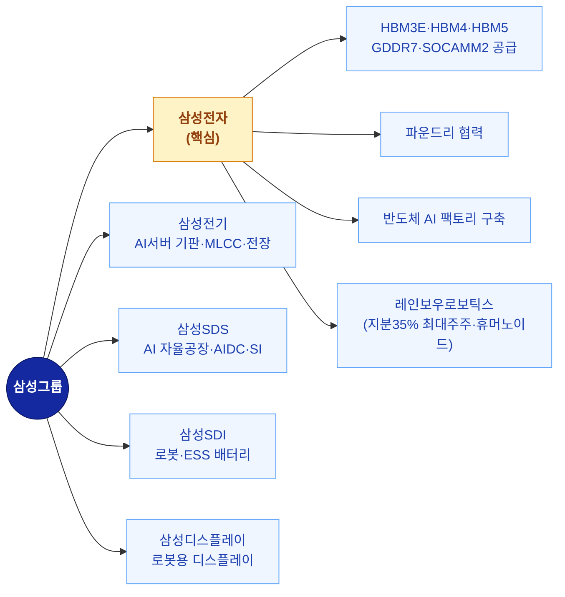
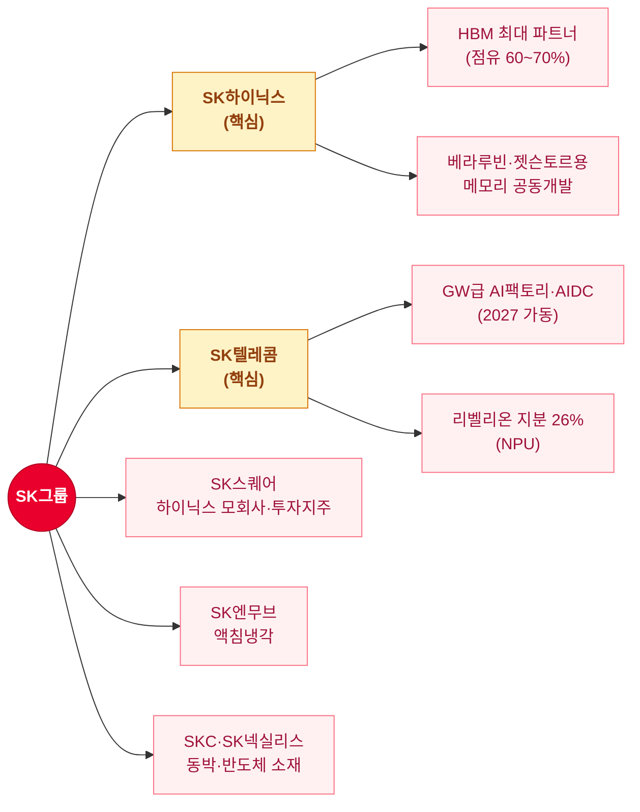
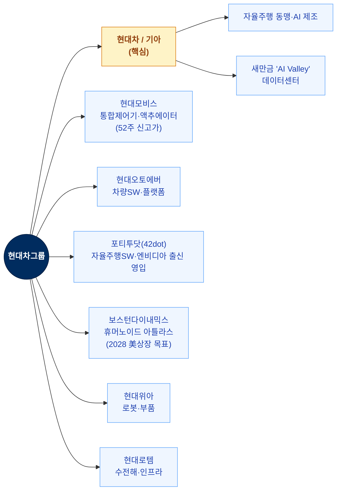
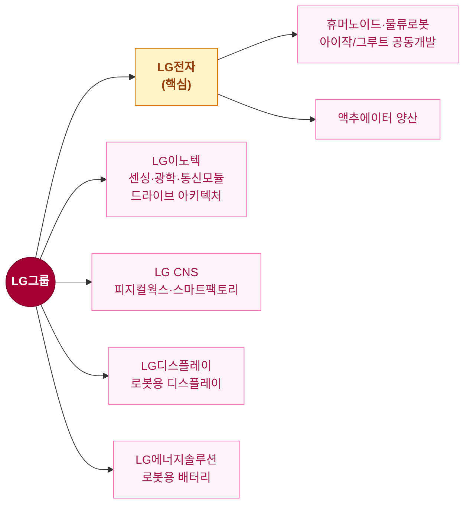
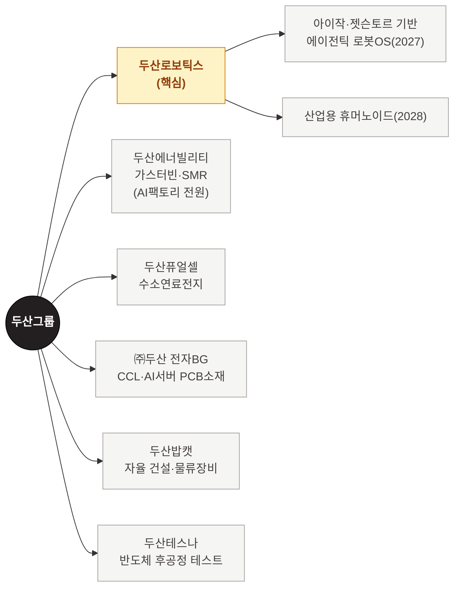
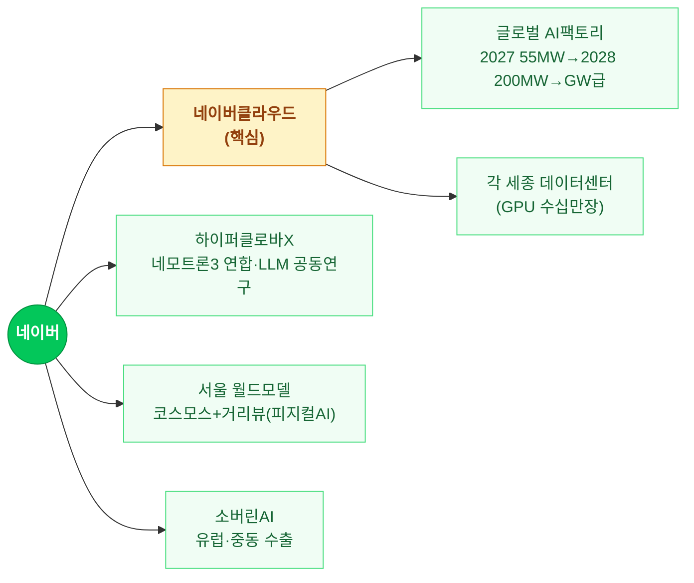

# 젠슨 황 방한 밸류체인 (엔비디아 × 한국 6대 그룹)

## 요약
젠슨 황 2차례 방한(2025-10 APEC 경주 / 2026-06 GTC 타이베이 직후)에서 한국을 "판매자→파트너"로 격상. 직접 호명 키워드: HBM·파운드리 / 로보틱스("한국의 다음 핵심 산업") / 모빌리티("엔비디아는 현대차를 사랑한다") / AI 데이터센터·팩토리 / 피지컬AI. 6대 그룹(삼성·SK·현대차·LG·두산·네이버) 각각 그룹 차원 파트너십으로 확대.

---

## 수급 상태
- 현재 수급: 🔥 강한 수급 집중 (발표 직후 일부 과열 → 차익실현)
- 주도 세력: 개인(추격 매수) vs 외국인(차익실현) — 방향 엇갈림
- 재료 등급: **구조적 성장**(AI 인프라·피지컬AI 다년 사이클) + 단기 이슈(이벤트성 급등락 혼재)

> ⚠️ [⚠️ 모순] 뉴스 강도와 실거래 역행: 2026-06-04 기준 LG전자 -17.4%, 두산로보틱스 -5.3%, 네이버 -4.6%, 엔씨소프트 -14.4% 등 발표 직후 외국인 차익실현 급락. 개인은 2025-10 재현 기대로 순매수(LG전자 2.2조). 발언=호재지만 진입 타이밍 별개. [[news-vs-realprice-crosscheck]] 적용 케이스.

---

## 발언 핵심 (소스)

### 1차: 2025-10 APEC 경주 (판매자 시점)
- 블랙웰 GPU **26만장(약 14조원)** 한국 우선 공급 — 삼성·SK·현대차 각 최대 5만장, 네이버클라우드 6만장
- 기업별 축 명시: 삼성=HBM / SK=AI팩토리 / 현대차=자율주행·로보틱스
- 깐부치킨 회동(이재용·정의선): "친구들과 치킨에 맥주, 깐부는 완벽한 장소"

### 2차: 2026-06-05~08 (피지컬AI 파트너 시점)
- "AI의 다음 물결은 모빌리티와 피지컬 AI" / "엔비디아는 현대차를 사랑한다"
- **"로보틱스가 한국의 다음 핵심 산업"** ← 섹터 톱픽 직접 지목
- HBM4 공급사 인증(6/5): 삼성·SK하이닉스·마이크론 3사 퀄 통과
- 동선: 현대차 사옥·네이버 사옥(로봇친화빌딩)·두산베어스 시구

---

## 그룹별 밸류체인 (Mermaid)

### 1️⃣ 삼성그룹

### 2️⃣ SK그룹

### 3️⃣ 현대차그룹

### 4️⃣ LG그룹 (피지컬AI 4대 동맹)

> ⚠️ LG전자: 6/2 사상최고 43.8만 → 발표 직후 -17.4% 급락(외국인 차익실현). 호재 선반영 구간.

### 5️⃣ 두산그룹 (에너지·로봇·소재 전방위)

### 6️⃣ 네이버 (소버린AI·글로벌 AI팩토리)

---

## 그룹 외 공통 수혜 (밸류체인 소부장·인프라)

| 클러스터             | 종목                                         |
| ---------------- | ------------------------------------------ |
| HBM 장비           | 한미반도체(TC본더), 이오테크닉스, 피에스케이홀딩스, 파크시스템스      |
| HBM 후공정·검사       | 테크윙, 와이씨, 디아이티, 두산테스나                      |
| HBM 소재           | 엠케이전자, 티씨케이, 디엔에프                          |
| 로봇 부품(감속기·액추에이터) | 에스피지, 에스비비테크, 로보티즈                         |
| 로봇 완제품           | 레인보우로보틱스, 두산로보틱스, 로보스타, 엔젤로보틱스, 해성에어로보틱스   |
| 전력기기(변압기·배전)     | HD현대일렉트릭, LS ELECTRIC, 효성중공업               |
| 전선·송전            | LS전선, 대한전선                                 |
| 냉각(액침)           | SK엔무브, 지엔씨에너지, GST                         |
| AI반도체 NPU        | 리벨리온(IPO 3Q 목표·SKT 지분26%), 퓨리오사AI(비상장), 파두 |
| 새만금 인프라          | 현대건설, 현대제철, 두산퓨얼셀, 한화솔루션, HD현대에너지솔루션       |

---

## 그룹 간 교차 핵심 (한 종목 다수 그룹 연결)
- **HBM**: 삼성전자 ↔ SK하이닉스 (직접 경쟁, 점유율 싸움 — 하이닉스 60~70% / 삼성 25~30%)
- **휴머노이드 4파전**: 삼성(레인보우) ↔ LG전자 ↔ 두산로보틱스 ↔ 현대(보스턴다이내믹스)
- **AI 데이터센터·전원**: SK텔레콤·네이버클라우드(구축) + 두산에너빌리티(전원) + HD현대일렉트릭·LS ELECTRIC(전력기기 공통)

---

## 연관 테마
[[themes/HBM]] | [[themes/AI데이터센터]] | [[themes/퓨리오사AI]] | [[themes/변압기]] | [[themes/SMR]] | [[themes/액침냉각]] | [[themes/LG전자]]

## 마지막 업데이트
2026-06-08 | WebSearch 종합(젠슨 황 2025-10 APEC + 2026-06 방한 발언 및 그룹별 파트너십)
